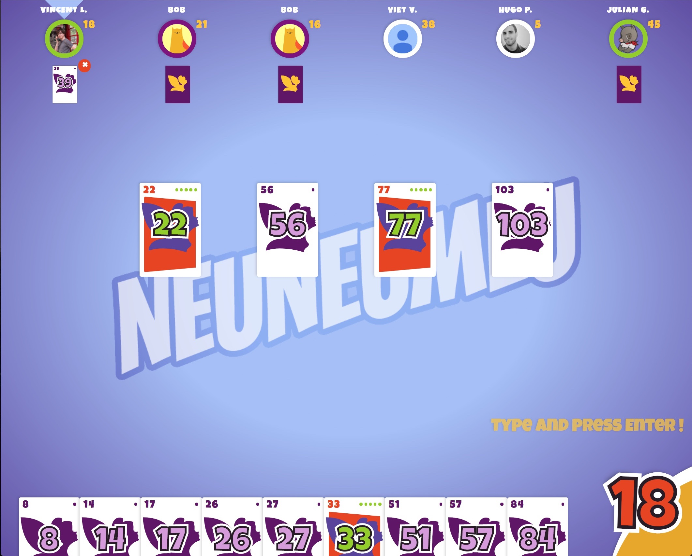

# (This isn't) 6 Nimmt !



## Description
Online multiplayer implementation of the card game. Made for fun as a side project to learn [react](https://facebook.github.io/react) and [redux](http://redux.js.org/).

Many thanks to this [great tutorial](http://teropa.info/blog/2015/09/10/full-stack-redux-tutorial.html) !

[Game Rules](https://en.wikipedia.org/wiki/6_Nimmt!)

Definitely not bug free ! Player beware. Still fun though. PRs welcome.

The game is hosted on https://cards.limbocitizen.com/.

## Get started
- Start a [rethinkdb](https://rethinkdb.com/) (using [docker](https://hub.docker.com/_/rethinkdb/) maybe)
- Fill out the relevant .env files
- And then:
  ```sh
  # In ~
  npm i
  # In neumeumeu-server
  npm start
  # In neumeumeu-client
  npm start
  ```
Enjoy !
